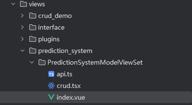
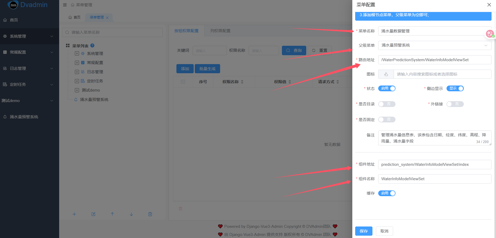
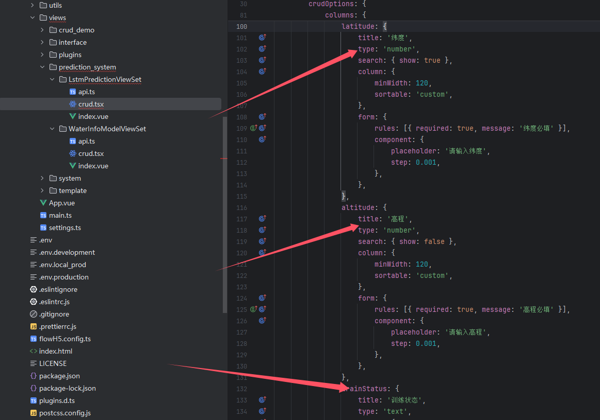

# 预警系统前后端开发

## 涌水量信息管理模块后端开发

### models.py编写

根据表写对应模型类

| 字段名称 | 字段代码           | 字段类型    | 非空    | 备注         |
|:----:|:--------------:|:-------:|:-----:|:----------:|
| 日期   | date           | varchar | false | 日期不能为空     |
| 经度   | longitude      | double  | false |            |
| 纬度   | latitude       | double  | false |            |
| 高程   | altitude       | double  | false |            |
| 日降水量 | rainfall       | double  | true  | 可以为空       |
| 涌水量  | water_quantity | double  | true  | 可以为空，但需要处理 |

```
#文件backend/crud_demo/models.py

from django.db import models

# Create your models here.
from dvadmin.utils.models import CoreModel


class WaterInfoModel(CoreModel):
    '''
    涌水量信息数据模型，用于预测已知地区的涌水量：
    日期
    横坐标
    纵坐标
    高程
    日降雨量
    涌水量
    '''
    date = models.DateField(verbose_name="日期")
    longitude = models.DecimalField(max_digits=24, decimal_places=6,verbose_name="经度")
    latitude = models.DecimalField(max_digits=24, decimal_places=6,verbose_name="纬度")
    altitude = models.DecimalField(max_digits=24, decimal_places=6, verbose_name="高程")
    rainfall = models.DecimalField(max_digits=24, decimal_places=6, verbose_name="日降水量")
    water_quantity = models.DecimalField(max_digits=24, decimal_places=6, verbose_name="涌水量")

    class Meta:
        db_table = "water_info"
        verbose_name = '涌水量信息表'
        verbose_name_plural = verbose_name
        ordering = ('longitude','latitude','altitude','date')
```

### serializers.py 编写

```
from prediction.models import WaterInfoModel
from dvadmin.utils.serializers import CustomModelSerializer


class WaterInfoModelSerializer(CustomModelSerializer):
    """
    序列化器
    """
#这里是进行了序列化模型及所有的字段
    class Meta:
        model = WaterInfoModel
        fields = "__all__"

#这里是创建/更新时的列化器
class WaterInfoModelCreateUpdateSerializer(CustomModelSerializer):
    """
    创建/更新时的列化器
    """

    class Meta:
        model = WaterInfoModel
        fields = '__all__' 
```

### view.py编写

```
from prediction_system.models import WaterInfoModel
from prediction_system.serializers import WaterInfoModelSerializer, WaterInfoModelCreateUpdateSerializer
from dvadmin.utils.viewset import CustomModelViewSet


class WaterInfoModelViewSet(CustomModelViewSet):
    """
    list:查询
    create:新增
    update:修改
    retrieve:单例
    destroy:删除
    """
    queryset = WaterInfoModel.objects.all()
    serializer_class = WaterInfoModelSerializer
    create_serializer_class = WaterInfoModelCreateUpdateSerializer
    update_serializer_class = WaterInfoModelCreateUpdateSerializer
```

### urls.py编写

```
#backend/crud_demo/urls.py

from rest_framework.routers import SimpleRouter

from .views import WaterInfoModelViewSet

router = SimpleRouter()
# 这里进行注册路径，并把视图关联上，这里的api地址以视图名称为后缀，这样方便记忆api/WaterInfoModelViewSet
router.register("api/WaterInfoModelViewSet", WaterInfoModelViewSet)

urlpatterns = [
]
urlpatterns += router.urls
```

### 在application的urls里导入我们的app

```
My_Urls = (
    [    #这里的crud_demo是指django创建的应用名称crud_demo
        path('',include('crud_demo.urls')),
        path('',include('prediction_system.urls'))
    ]
)

# 这里把自己的路径单独出来，后面再追加在一起
urlpatterns += My_Urls
```

### 执行迁移

```
python manage.py makemigrations
python manage.py migrate
```

## 已知区域涌水量预警系统前端开发

### 前端目录

在web下找到views目录，并创建如下目录以及文件



### api.ts

    该文件实现添删改查请求接口，实际开发中，修改apiPrefixr的值即可，你也可以在此页面根据实际业务需求增加和修改方法。

    API模块封装，通过函数封装了与后端交互的细节，使得在业务组件中调用变得简单。

    注意：export const apiPrefix = '/api/WaterInfoModelViewSet'此处的前缀需要与后端的相同，可以去后端的两个urls文件进行查看。

```
import { request,downloadFile } from '/@/utils/service';
import { PageQuery, AddReq, DelReq, EditReq, InfoReq } from '@fast-crud/fast-crud';

export const apiPrefix = '/api/WaterInfoModelViewSet/';

export function GetList(query: PageQuery) {
    return request({
        url: apiPrefix,                 // 请求地址：/api/WaterInfoModelViewSet/
        method: 'get',                  // GET 请求
        params: query,                  // 查询参数（分页、过滤等）
    });
}
export function GetObj(id: InfoReq) {
    return request({
        url: apiPrefix + id,            // 请求地址：/api/WaterInfoModelViewSet/{id}
        method: 'get',                  // GET 请求
    });
}

export function AddObj(obj: AddReq) {
    return request({
        url: apiPrefix,                 // 请求地址：/api/WaterInfoModelViewSet/
        method: 'post',                 // POST 请求
        data: obj,                      // 要添加的对象数据
    });
}

export function UpdateObj(obj: EditReq) {
    return request({
        url: apiPrefix + obj.id + '/',      // 请求地址：/api/WaterInfoModelViewSet/{id}/
        method: 'put',                      // PUT 请求
        data: obj,                          // 更新后的对象数据
    });
}

export function DelObj(id: DelReq) {
    return request({
        url: apiPrefix + id + '/',          // 请求地址：/api/WaterInfoModelViewSet/{id}/
        method: 'delete',                   // DELETE 请求
        data: { id },                       // 要删除的对象ID（可选，有些API需要）
    });
}

export function exportData(params:any){
    // 使用专门的下载文件函数
    return downloadFile({
        url: apiPrefix + 'export_data/',        // 导出地址：/api/WaterInfoModelViewSet/export_data/
        params: params,                         // 导出参数（过滤条件等）
        method: 'get'                           // GET 请求
    })
}
```

### index.vue

文件`web/src/views/crud_demo/PredictionSystemModelViewSet/index.vue`

主要修改下述api接口以及模块名称：


```
<template>
  <fs-page class="PageFeatureSearchMulti">
    <fs-crud ref="crudRef" v-bind="crudBinding">
      <template #cell_url="scope">
        <el-tag size="small">{{ scope.row.url }}</el-tag>
      </template>
      <!-- 注释编号: django-vue3-admin-index442216: -->
      <!-- 注释编号:django-vue3-admin-index39263917:代码开始行-->
      <!--  功能说明:使用导入组件，并且修改api地址为当前对应的api，当前是demo的api="api/CrudDemoModelViewSet/"-->
      <template #actionbar-right>
        <importExcel api="api/WaterInfoModelViewSet/" v-auth="'user:Import'">导入</importExcel>
      </template>
      <!--  注释编号:django-vue3-admin-index263917:代码结束行-->

    </fs-crud>
  </fs-page>
</template>

<script lang="ts">
import { onMounted, getCurrentInstance, defineComponent} from 'vue';
import { useFs } from '@fast-crud/fast-crud';
import createCrudOptions  from './crud';

// 注释编号: django-vue3-admin-index192316:导入组件
import importExcel from '/@/components/importExcel/index.vue'


export default defineComponent({    //这里配置defineComponent
  name: "WaterInfoModelViewSet",   //把name放在这里进行配置了
  components: {importExcel},  //注释编号: django-vue3-admin-index552416: 注册组件，把importExcel组件放在这里，这样<template></template>中才能正确的引用到组件
  setup() {   //这里配置了setup()

    const instance = getCurrentInstance();

    const context: any = {
      componentName: instance?.type.name
    };

    const { crudBinding, crudRef, crudExpose, resetCrudOptions } = useFs({ createCrudOptions, context});


    // 页面打开后获取列表数据
    onMounted(() => {
      crudExpose.doRefresh();
    });
    return {
      //增加了return把需要给上面<template>内调用的<fs-crud ref="crudRef" v-bind="crudBinding">
      crudBinding,
      crudRef,
    };


  }     //这里关闭setup()
});  //关闭defineComponent

</script>
```

### crud.tsx

主要修改columns中的数据字段，确保与后端数据模型一致

```
import { CrudOptions, AddReq, DelReq, EditReq, dict, CrudExpose, UserPageQuery, CreateCrudOptionsRet} from '@fast-crud/fast-crud';
import _ from 'lodash-es';
import * as api from './api';
import { request } from '/@/utils/service';
import {auth} from "/@/utils/authFunction";

//此处为crudOptions配置
export default function ({ crudExpose}: { crudExpose: CrudExpose}): CreateCrudOptionsRet {
    const pageRequest = async (query: any) => {
        return await api.GetList(query);
    };
    const editRequest = async ({ form, row }: EditReq) => {
        if (row.id) {
            form.id = row.id;
        }
        return await api.UpdateObj(form);
    };
    const delRequest = async ({ row }: DelReq) => {
        return await api.DelObj(row.id);
    };
    const addRequest = async ({ form }: AddReq) => {
        return await api.AddObj(form);
    };

    const exportRequest = async (query: UserPageQuery) => {
        return await api.exportData(query)
    };

    return {
        crudOptions: {
            request: {
                pageRequest,
                addRequest,
                editRequest,
                delRequest,
            },
            actionbar: {
                buttons: {
                    export:{
                        // 注释编号:django-vue3-admin-crud210716:注意这个auth里面的值，最好是使用index.vue文件里面的name值并加上请求动作的单词
                        show: auth('WaterInfoModelViewSet:Export'),
                        text:"导出",//按钮文字
                        title:"导出",//鼠标停留显示的信息
                        click(){
                            return exportRequest(crudExpose.getSearchFormData())
                            // return exportRequest(crudExpose!.getSearchFormData())    // 注意这个crudExpose!.getSearchFormData()，一些低版本的环境是需要添加!的
                        }
                    },
                    add: {
                        show: auth('WaterInfoModelViewSet:Create'),
                    },
                }
            },
            rowHandle: {
                //固定右侧
                fixed: 'right',
                width: 200,
                buttons: {
                    view: {
                        type: 'text',
                        order: 1,
                        show: auth('WaterInfoModelViewSet:Retrieve')
                    },
                    edit: {
                        type: 'text',
                        order: 2,
                        show: auth('WaterInfoModelViewSet:Update')
                    },
                    copy: {
                        type: 'text',
                        order: 3,
                        show: auth('WaterInfoModelViewSet:Copy')
                    },
                    remove: {
                        type: 'text',
                        order: 4,
                        show: auth('WaterInfoModelViewSet:Delete')
                    },
                },
            },
            columns: {
                date: {
                    title: '日期',
                    type: 'date',
                    search: { show: true},
                    column: {
                        minWidth: 120,
                        sortable: 'custom',
                    },
                    form: {
                        rules: [{ required: true, message: '日期必填' }],
                        component: {
                            format: "YYYY-MM-DD",
                            valueFormat: "YYYY-MM-DD",
                            placeholder: '请选择日期',
                        },
                    },
                },
                longitude: {
                    title: '经度',
                    type: 'number',
                    search: { show: true },
                    column: {
                        minWidth: 120,
                        sortable: 'custom',
                    },
                    form: {
                        rules: [{ required: true, message: '经度必填' }],
                        component: {
                            placeholder: '请输入经度',
                            // 控制小数位数为6位
                            step: 0.000001,
                        },
                    },
                },

                latitude: {
                    title: '纬度',
                    type: 'number',
                    search: { show: true },
                    column: {
                        minWidth: 120,
                        sortable: 'custom',
                    },
                    form: {
                        rules: [{ required: true, message: '纬度必填' }],
                        component: {
                            placeholder: '请输入纬度',
                            step: 0.000001,
                        },
                    },
                },
                altitude: {
                    title: '高程',
                    type: 'number',
                    search: { show: false },
                    column: {
                        minWidth: 120,
                        sortable: 'custom',
                    },
                    form: {
                        rules: [{ required: true, message: '高程必填' }],
                        component: {
                            placeholder: '请输入高程',
                            step: 0.000001,
                        },
                    },
                },
                rainfall: {
                    title: '日降雨量',
                    type: 'number',
                    search: { show: false },
                    column: {
                        minWidth: 120,
                        sortable: 'custom',
                    },
                    form: {
                        rules: [{ required: true, message: '日降雨量必填' }],
                        component: {
                            placeholder: '请输入日降雨量',
                            step: 0.000001,
                        },
                    },
                },
                water_quantity: {
                    title: '涌水量',
                    type: 'number',
                    search: {show: false},
                    column: {
                        minWidth: 120,
                        sortable: 'custom',
                    },
                    form: {
                        rules: [{required: true, message: '涌水量必填'}],
                        component: {
                            placeholder: '请输入涌水量',
                            step: 0.000001,
                        },
                    },
                },
            },
        },
    };
}
```

### 配置菜单


在此目录下，配置子菜单，注意组件地质为index所在目录，组件地址为index代码里面name取值：



### 配置按钮权限

| 序号  | 权限名称 | 权限值                            | 请求方式   | 接口地址                                    |
| --- | ---- | ------------------------------ | ------ | --------------------------------------- |
| 1   | 新增   | WaterInfoModelViewSet:Create   | POST   | /api/WaterInfoModelViewSet              |
| 2   | 编辑   | WaterInfoModelViewSet:Update   | PUT    | /api/WaterInfoModelViewSet/{id}/        |
| 3   | 删除   | WaterInfoModelViewSet:Delete   | DELETE | /api/WaterInfoModelViewSet/{id}/        |
| 4   | 查询   | WaterInfoModelViewSet:Search   | GET    | /api/WaterInfoModelViewSet              |
| 5   | 查看   | WaterInfoModelViewSet:Retrieve | GET    | /api/WaterInfoModelViewSet/{id}/        |
| 6   | 导出   | WaterInfoModelViewSet:Export   | POST   | /api/WaterInfoModelViewSet/export_data/ |
| 7   | 导入   | WaterInfoModelViewSet:Import   | POST   | /api/WaterInfoModelViewSet/import_data/ |
| 8   | 复制   | WaterInfoModelViewSet:Copy     | POST   | /api/WaterInfoModelViewSet              |


### 导入导出配置

在serializers.py中单独添加导入和导出的序列化器

```
#导入时用到的列化器
class WaterInfoModelImportSerializer(CustomModelSerializer):
    """
    WaterInfoModel导入时的列化器
    """

    class Meta:
        model = WaterInfoModel
        fields = '__all__'

#导出时用到的列化器
class ExportWaterInfoModelSerializer(CustomModelSerializer):
    """
    WaterInfoModel导入时的列化器
    """

    class Meta:
        model = WaterInfoModel
        fields = '__all__'
```

### 在view.py中配置相关信息

需要引入WaterInfoModelImportSerialize和ExportWaterInfoModelSerializer

```
from prediction_system.models import WaterInfoModel
from prediction_system.serializers import WaterInfoModelSerializer, WaterInfoModelCreateUpdateSerializer， WaterInfoModelImportSerializer, ExportWaterInfoModelSerializer
from dvadmin.utils.viewset import CustomModelViewSet


class WaterInfoModelViewSet(CustomModelViewSet):
    """
    list:查询
    create:新增
    update:修改
    retrieve:单例
    destroy:删除
    """
    # 功能说明:导入的配置
    import_field_dict = {
        "date": {
            "title": '日期',
            "display":'date',
            "type": "date"
        },
        "longitude": "经度",
        "latitude": "纬度",
        "altitude": "高程",
        "rainfall": "日降雨量",
        "water_quantity": "涌水量"
    }

    # 导入序列化器
    import_serializer_class = WaterInfoModelImportSerializer

    export_field_label = {
        "date": {
            "title": '日期',
            "display": 'date',
            "type": "date"
        },
        "longitude": "经度",
        "latitude": "纬度",
        "altitude": "高程",
        "rainfall": "日降雨量",
        "water_quantity": "涌水量"
    }

    # 导入序列化器
    import_serializer_class = WaterInfoModelImportSerializer
    # 导出序列化器
    export_serializer_class = ExportWaterInfoModelSerializer

    queryset = WaterInfoModel.objects.all()
    serializer_class = WaterInfoModelSerializer
    create_serializer_class = WaterInfoModelCreateUpdateSerializer
    update_serializer_class = WaterInfoModelCreateUpdateSerializer
```

## 开发一键删除接口

### 在view.py自定义接口

对于增删改查接口，框架会自己生成相应的接口，而对于一键删除，则需要自定义，定义如下：

```
from prediction_system.models import WaterInfoModel
from prediction_system.serializers import WaterInfoModelSerializer, WaterInfoModelCreateUpdateSerializer, WaterInfoModelImportSerializer, ExportWaterInfoModelSerializer
from dvadmin.utils.viewset import CustomModelViewSet
# 需要引入的模块
from django.db import transaction
from rest_framework.decorators import action
from rest_framework.response import Response
from rest_framework import status


class WaterInfoModelViewSet(CustomModelViewSet):
    """
    list:查询
    create:新增
    update:修改
    retrieve:单例
    destroy:删除
    """
    # 功能说明:导入的配置
    import_field_dict = {
        "date": {
            "title": '日期',
            "display":'date',
            "type": "date"
        },
        "longitude": "经度",
        "latitude": "纬度",
        "altitude": "高程",
        "rainfall": "日降雨量",
        "water_quantity": "涌水量"
    }

    # 导入序列化器
    import_serializer_class = WaterInfoModelImportSerializer

    export_field_label = {
        "date": {
            "title": '日期',
            "display": 'date',
            "type": "date"
        },
        "longitude": "经度",
        "latitude": "纬度",
        "altitude": "高程",
        "rainfall": "日降雨量",
        "water_quantity": "涌水量"
    }

    # 导入序列化器
    import_serializer_class = WaterInfoModelImportSerializer
    # 导出序列化器
    export_serializer_class = ExportWaterInfoModelSerializer

    queryset = WaterInfoModel.objects.all()
    serializer_class = WaterInfoModelSerializer
    create_serializer_class = WaterInfoModelCreateUpdateSerializer
    update_serializer_class = WaterInfoModelCreateUpdateSerializer

    # 一键删除的接口自定义
    @action(detail=False, methods=['delete'], url_path='delete-all')
    def delete_all(self, request):
        """
        删除所有涌水量信息数据
        """
        # 添加权限检查（可选但推荐）
        if not request.user.has_perm('prediction_system.delete_waterinfomodel'):
            return Response({'detail': '权限不足'}, status=status.HTTP_403_FORBIDDEN)

        # 执行删除操作
        try:
            # 使用事务确保操作的原子性
            with transaction.atomic():
                deleted_count, _ = self.get_queryset().delete()
            return Response({'message': f'成功删除 {deleted_count} 条数据'}, status=status.HTTP_200_OK)
        except Exception as e:
            return Response({'detail': f'删除失败: {str(e)}'}, status=status.HTTP_500_INTERNAL_SERVER_ERROR)
```

### api.ts中添加请求函数


```
// 一键删除的请求函数，用于调用后端一键删除接口
export function deleteAllWaterInfo() {
    return request({
        url: apiPrefix + 'delete-all/',
        method: 'delete',
    });
}
```

### 在crud.tsx的顶部操作栏中添加一个一键删除的按钮

```
buttons: {
                    export:{
                        // 注释编号:django-vue3-admin-crud210716:注意这个auth里面的值，最好是使用index.vue文件里面的name值并加上请求动作的单词
                        show: auth('WaterInfoModelViewSet:Export'),
                        text:"导出",//按钮文字
                        title:"导出",//鼠标停留显示的信息
                        click(){
                            return exportRequest(crudExpose.getSearchFormData())
                            // return exportRequest(crudExpose!.getSearchFormData())    // 注意这个crudExpose!.getSearchFormData()，一些低版本的环境是需要添加!的
                        }
                    },
                    add: {
                        show: auth('WaterInfoModelViewSet:Create'),
                    },
                    deleteAll: {
                        show: auth('WaterInfoModelViewSet:DeleteAll'), // 假设这里有对应的权限检查
                        text: "删除所有数据",
                        title: "删除所有涌水量信息数据",
                        click() {
                            return api.deleteAllWaterInfo().then(() => {
                                crudExpose.doRefresh(); // 删除成功后刷新列表
                            });
                        }
                    },
                }
```


### 修改导入请求的超时时间

进入service.ts中找到对应函数将时间增加到10秒。


### 解决测试单个py文件无法导入相关模块的问题

单个Python文件编译需要指定查找路径，例如

```
import sys
# 拼接项目根目录路径（根据实际项目结构调整，比如你的项目根是 PredictionSystem/backend ）
sys.path.append("E:/Python_Code/PredictionSystem/backend")

from model.LstmModel import LstmModelTrainAll
```


## Lstm训练所有数据接口开发

### lstm模型类文件夹

在backend文件夹分别创建如图所示文件


### 设计预处理、模型训练、可视化的方法

这里设计自己的模型以及调用方法，后续view视图会调用这里的方法进行训练等功能。


### LstmViewset编写

在views.py文件中新增一个视图类，用于管理Lstm模型训练、可视化等功能

```
# Lstm模型视图类，包含训练以及可视化，日志展示等功能
class LtsmModelViewSet(CustomModelViewSet):
    # 获取water_info中的所有数据
    queryset = WaterInfoModel.objects.all()
    serializer_class = WaterInfoModelSerializer

    # Lstm模型训练函数
    @action(detail=False, methods=['post'], url_path='lstm-trainall')
    def Lstm_Train_All(self, request):
        try:
            # 获取查询集
            queryset = self.get_queryset()
            # 检查是否有数据
            if not queryset.exists():
                return Response({'detail': '数据不存在，请先导入数据'}, status=status.HTTP_400_BAD_REQUEST)

            # 将数据转化为pandas
            data = list(queryset.values())
            df = pd.DataFrame(data)

            # 调用模型进行训练
            # result为'success'表示所有模型训练成功,否则表示失败
            result = LstmModelTrainAll(df)

            # 根据返回结果判断训练是否成功
            if result == 'success':
                return Response({
                    'message': '模型训练成功',
                    'data_count': len(df),
                }, status=status.HTTP_200_OK)
            else:
                # 记录详细的错误日志
                import logging
                logger = logging.getLogger(__name__)
                logger.error(f"模型训练失败: {result}")

                return Response({
                    'detail': '模型训练失败',
                    'error': result
                }, status=status.HTTP_500_INTERNAL_SERVER_ERROR)

        except Exception as e:
            logger = logging.getLogger(__name__)
            logger.error(f"模型训练失败: {str(e)}", exc_info=True)

            return Response({
                'detail': '模型训练失败',
                'error': str(e)
            }, status=status.HTTP_500_INTERNAL_SERVER_ERROR)
```


## Lstm模型训练添加和删除训练状态接口开发

### model.py添加新数据模型

此数据模型方便前端展示哪些点已经训练，哪些点未训练

```
class LstmTrainStatusModel(CoreModel):
    '''
    Lstm训练情况数据模型，用于记录是否已经导入数据，且是否已经训练：
    经度
    纬度
    高程
    是否训练,0表示未训练，1表示已经训练
    '''
    longitude = models.DecimalField(max_digits=15, decimal_places=3, verbose_name="经度")
    latitude = models.DecimalField(max_digits=15, decimal_places=3, verbose_name="纬度")
    altitude = models.DecimalField(max_digits=15, decimal_places=3, verbose_name="高程")
    # 是否训练字段，使用IntegerField并设置choices参数
    IS_TRAIN_CHOICES = (
        (0, '未训练'),
        (1, '已训练'),
    )
    is_train = models.IntegerField(
        choices=IS_TRAIN_CHOICES,
        default=0,
        verbose_name="该点模型是否训练"
    )

    class Meta:
        db_table = "lstm_train_status"
        verbose_name = 'LSTM训练状态表'
        verbose_name_plural = verbose_name
        ordering = ('longitude', 'latitude', 'altitude')
```

### 执行数据库迁移

需要先删除数据库的迁移记录，在mysql中执行下面的代码：

```
DELETE FROM django_migrations WHERE app = 'prediction_system';
```

在pycharm中删除迁移文件0001_initial.py


执行迁移命令：

```
python manage.py makemigrations
python manage.py migrate
```

### 重写model_info的序列化器中create

实现在添加model_info表的状态时，同步添加lstm_train_status中的数据，在WaterInfoModelCreateUpdateSerializer中进行重写，添加时会使训练状态表有相应数据

```
    def create(self, validated_data):
        # 创建 WaterInfoModel 实例
        water_info_instance = WaterInfoModel.objects.create(**validated_data)

        # 从 validated_data 中获取经度、纬度和高程
        longitude = validated_data.get('longitude')
        latitude = validated_data.get('latitude')
        altitude = validated_data.get('altitude')

        # 检查 LstmTrainStatusModel 中是否已经存在该经纬度和高程的记录
        lstm_train_status, created = LstmTrainStatusModel.objects.get_or_create(
            longitude=longitude,
            latitude=latitude,
            altitude=altitude,
            defaults={'is_train': 0}
        )

        return water_info_instance
```

### 在一键删除的接口中添加一行代码实现同步一键删除

```
# 附带删除训练状态中所有数据
status_deleted_count, _ = LstmTrainStatusModel.objects.all().delete()
```


### 实现批量导入water_info时同步添加lstm_trian_status表

只需要重写water_info数据模型中的导入序列化器中create方法即可

文件路径：prediction_system\serializers.py

```
#导入时用到的列化器
class WaterInfoModelImportSerializer(CustomModelSerializer):
    """
    WaterInfoModel导入时的列化器
    """

    class Meta:
        model = WaterInfoModel
        fields = '__all__'

    def create(self, validated_data):
        if isinstance(validated_data, list):  # 处理批量导入
            with transaction.atomic():
                instances = []
                for data in validated_data:
                    longitude = data.get('longitude')
                    latitude = data.get('latitude')
                    altitude = data.get('altitude')
                    # 检查 LstmTrainStatusModel 中是否已经存在该经纬度和高程的记录
                    lstm_train_status, created = LstmTrainStatusModel.objects.get_or_create(
                        longitude=longitude,
                        latitude=latitude,
                        altitude=altitude,
                        defaults={'is_train': 0}
                    )
                    instance = WaterInfoModel.objects.create(**data)
                    instances.append(instance)
                return instances
        else:  # 处理单条导入
            longitude = validated_data.get('longitude')
            latitude = validated_data.get('latitude')
            altitude = validated_data.get('altitude')
            # 检查 LstmTrainStatusModel 中是否已经存在该经纬度和高程的记录
            lstm_train_status, created = LstmTrainStatusModel.objects.get_or_create(
                longitude=longitude,
                latitude=latitude,
                altitude=altitude,
                defaults={'is_train': 0}
            )
            return WaterInfoModel.objects.create(**validated_data)
```

## 模型状态展示接口实现

### views.py修改

serializer_class和queryset是底层crud需要指定的，WaterData是自定义用于训练的数据集。


### 视图绑定路由

在urls.py中绑定相关路由


### 前端相关配置

将模板的api.ts、crud.tsx、index.vue复制到该组件目录下，修改api.ts中url前缀


修改crud.tsx中所有相关url到自己的url中


定义curd.tsx中前端需要展示的列名以及内容，与数据库对齐就行



在index.vue中修改组件名称


### 配置菜单


### 配置权限按钮

批量生成即可


### 结果展示


